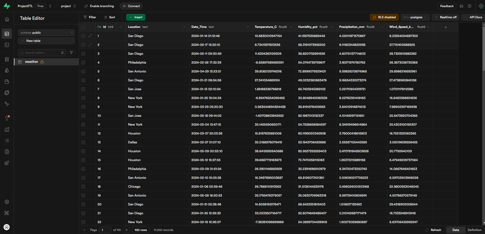
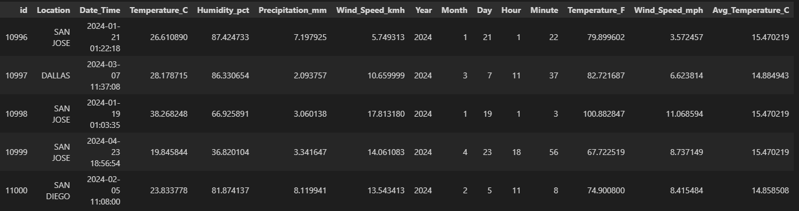
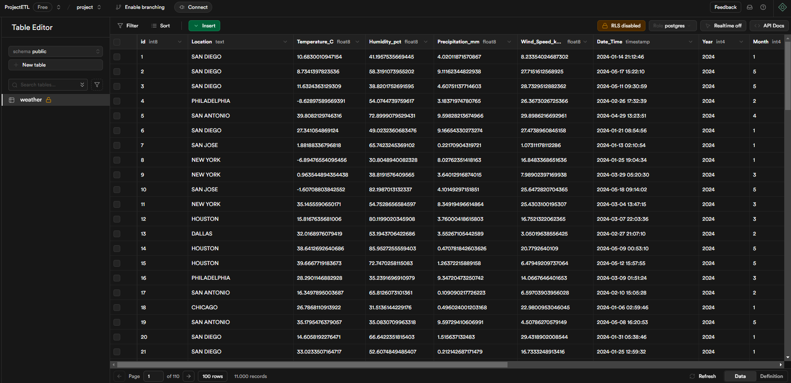
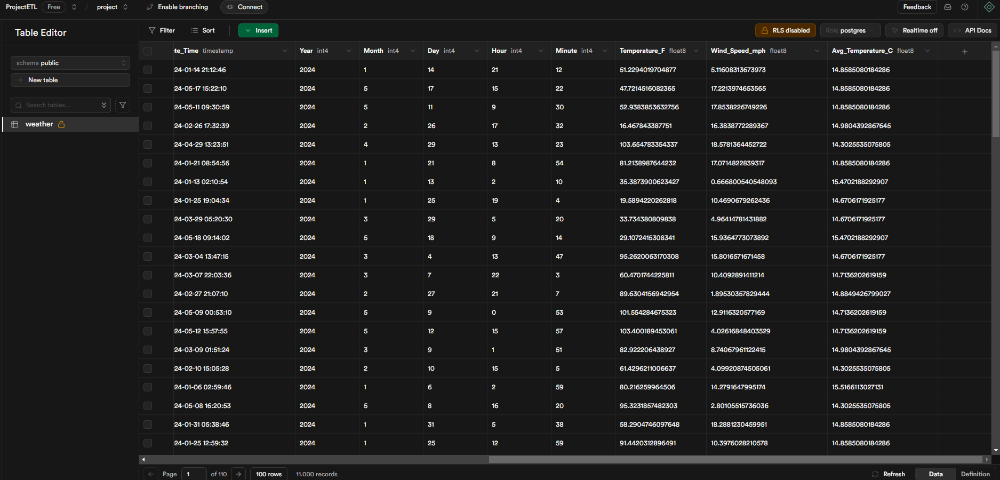
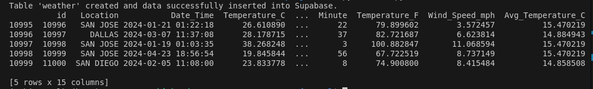
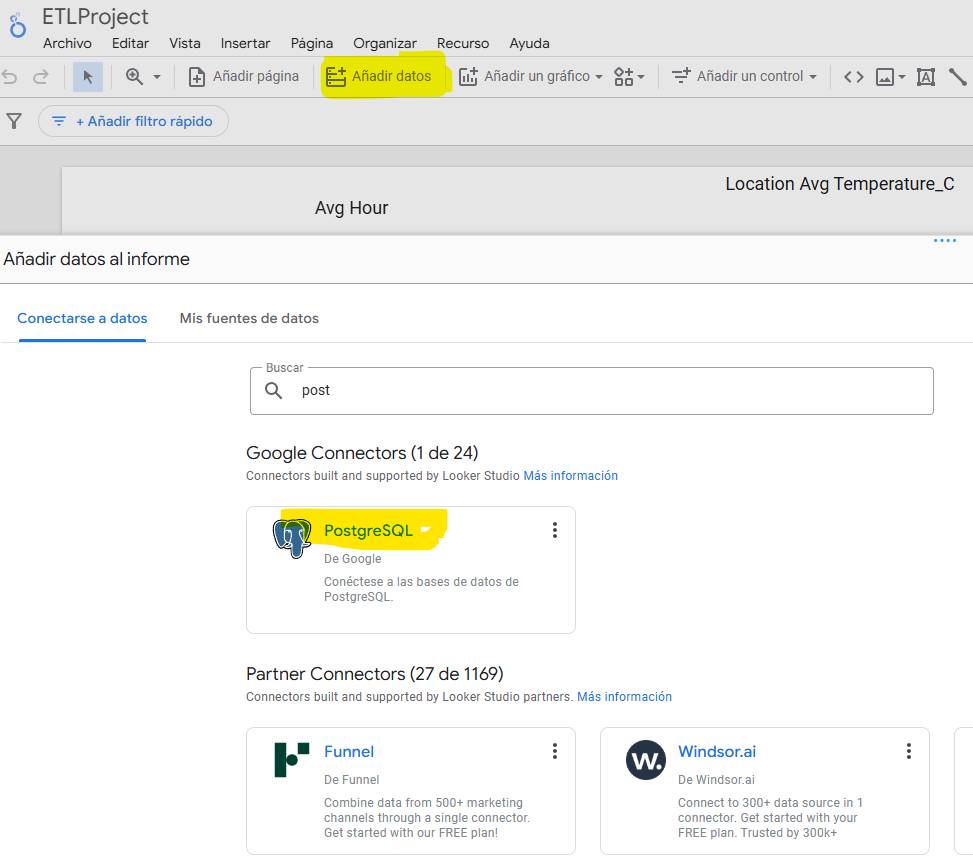
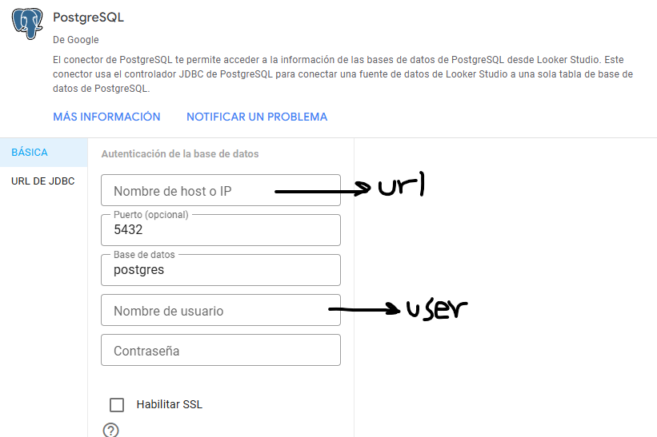
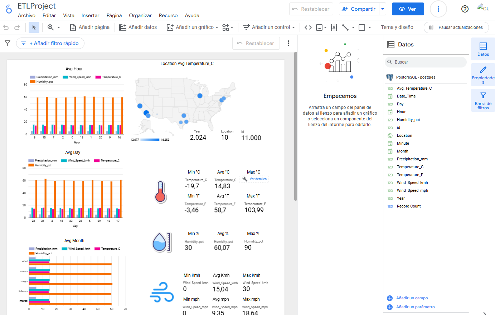
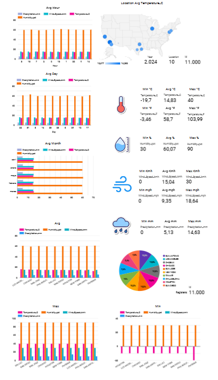

# Project ETL

<p align="justify">
The project ETL involves selecting data sources (CSV, APIs, databases), extracting the data using Python, and storing it in a relational database. After performing exploratory data analysis (EDA), raw data is transformed to solve the problem. If necessary, data is merged, processed, and loaded back into the database. Finally, a dashboard is created using tools like Power BI or Looker Studio.
</p>

<p align="center">
  
</p>

## Dataset: [Weather Data](https://www.kaggle.com/datasets/prasad22/weather-data)

<p align="justify">
This dataset contains synthetic weather data generated for ten different locations, including New York, Los Angeles, Chicago, Houston, Phoenix, Philadelphia, San Antonio, San Diego, Dallas, and San Jose. The data includes information about temperature, humidity, precipitation, and wind speed, with 1 million data points generated for each parameter
</p>

Features:
* Location: The city where the weather data was simulated.
* Date_Time: The date and time when the weather data was recorded.
* Temperature_C: The temperature in Celsius at the given location and time.
* Humidity_pct: The humidity in percentage at the given location and time.
* Precipitation_mm: The precipitation in millimeters at the given location and time.
* Wind_Speed_kmh: The wind speed in kilometers per hour at the given location and time.


### Phase 1

<p align="justify">
The first phase involves extracting data from a source, in this case a .csv file, using Python and uploading the information to a database, which in this case is Supabase.
</p>

<p align="center">
  
</p>

#### Steps for develop Phase 1

1. Create a database in Supabase

<p align="center">
  
</p>

2. Connect the Supabase database and choose the connection, in this case, "Session pooler"

<p align="center">
  
</p>

3. Upload data from the .csv to the database by following the file Phase1Load\001_loadPhase1.ipynb

4. View the uploaded data in the Supabase database

<p align="center">
  
</p>

> **Note:** if you want use in local the part of load, use 001_loadPhase1cript.py and install requirements.txt in your enviroment.
> 
```python
pip install -r requirements.txt
```

-----

### Phase 2

<p align="justify">
The second phase performs the transformation and merging of the dataset uploaded to the DB.
</p>

<p align="center">
  
</p>

The following transformations are performed:
*  Extract year, month, day, hour, and minute from Date_Time
*  Convert Location to uppercase
*  Normalize Temperature_C to Fahrenheit
*  Normalize Wind_Speed_kmh to mph
*  Average temperature per location

<p align="center">
  
</p>


Result in supabase
<p align="center">
  
</p>
<p align="center">
  
</p>

-----

### Phase 3

<p align="justify">
The third phase performs the direct automation of the ETL part, where it is executed with a single command and the data set loaded into the database is displayed in a dashboard.
</p>

<p align="center">
  
</p>

<p align="justify">
To create the complete automation of the process for all phases of data extraction, transformation, and loading, with Python we create and structure a Python file where, through functions that correspond to each of the phases, it executes automatically in a direct way. This is in the file called "etl.py" which works, clarifying that our db is empty from the beginning, where the output provides evidence of the successful ETL process performed
</p>

From the folder "Phase3Visualization" and saved Phase3Visualization/config.yaml  and Phase3Visualization/weather_data.csv

```python
python etl.py
```
<p align="center">
  
</p>

The following steps are performed when creating a dashboard:

1. First, go to "https://lookerstudio.google.com" and register and log in. After that, create your respective project. To add data from our database such as Supabase which uses PostgreSQL, click on add data and search for PostgreSQL
<p align="center">
  
</p>  

2.  After doing this, it requests the DB configuration in the following image. Since Supabase is being used, it should be done as follows: in databases enter "postgres" and for the port enter "5432". Where it asks for the host or IP, enter the URL, and for the username enter the user.
<p align="center">
  
</p>  

3. Once the successful connection with the DB is established, proceed to manipulate the data and create the dashboard with the different parameters and data obtained from the DB
<p align="center">
  
</p> 


<p align="center">
  
</p> 


-----

Created by [Diego Ivan Perea Montealegre](https://github.com/diegoperea20)