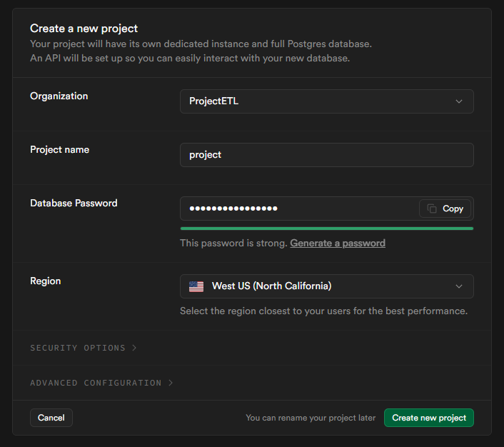

# Project ETL

The project ETL involves selecting data sources (CSV, APIs, databases), extracting the data using Python, and storing it in a relational database. After performing exploratory data analysis (EDA), raw data is transformed to solve the problem. If necessary, data is merged, processed, and loaded back into the database. Finally, a dashboard is created using tools like Power BI or Looker Studio.

  

## Dataset: [Weather Data](https://www.kaggle.com/datasets/prasad22/weather-data)

This dataset contains synthetic weather data generated for ten different locations, including New York, Los Angeles, Chicago, Houston, Phoenix, Philadelphia, San Antonio, San Diego, Dallas, and San Jose. The data includes information about temperature, humidity, precipitation, and wind speed, with 1 million data points generated for each parameter

Features:
* Location: The city where the weather data was simulated.
* Date_Time: The date and time when the weather data was recorded.
* Temperature_C: The temperature in Celsius at the given location and time.
* Humidity_pct: The humidity in percentage at the given location and time.
* Precipitation_mm: The precipitation in millimeters at the given location and time.
* Wind_Speed_kmh: The wind speed in kilometers per hour at the given location and time.

### Phase 1

The first phase involves extracting data from a source, in this case a .csv file, using Python and uploading the information to a database, which in this case is Supabase.

  

#### Steps for develop Phase 1

1. Create a database in Supabase

  

2. Connect the Supabase database and choose the connection, in this case, "Session pooler"

  

3. Upload data from the .csv to the database by following the file Phase1Load\001_loadPhase1.ipynb

4. View the uploaded data in the Supabase database

  

